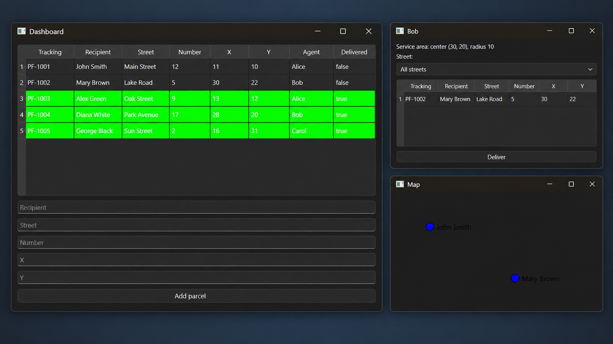
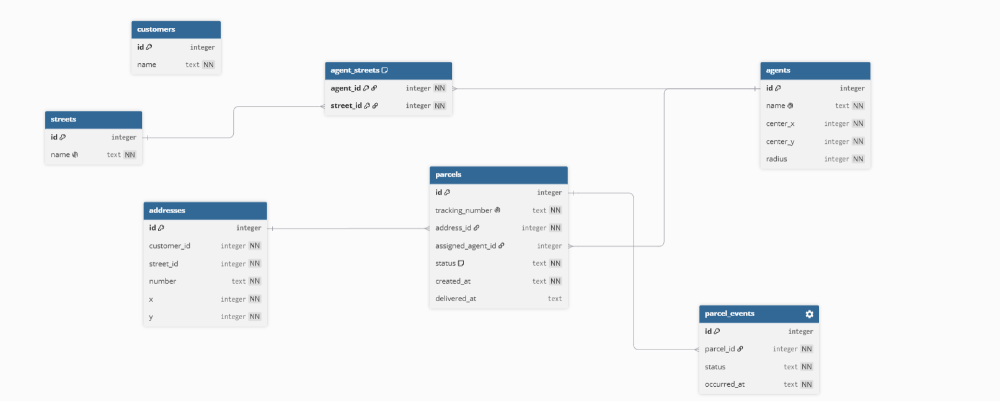

# ParcelFlow

ParcelFlow is a desktop parcel-delivery management application built with C++17, Qt 6, and SQLite. It manages customers, addresses, parcels, delivery agents, automatic agent assignment, and delivery history through a graphical interface.

This project was created as a student portfolio project to practise object-oriented design, layered architecture, relational databases, GUI development, input validation, and automated testing.

## Application preview

## Features

- Create parcels for customers and addresses
- Store application data permanently in SQLite
- Generate unique `PF-<UUID>` tracking numbers
- Assign parcels automatically by street coverage or delivery radius
- Select the closest agent when several agents are eligible
- Identify parcels that cannot currently be assigned
- Display separate delivery windows for every agent
- Mark parcels as delivered and record delivery timestamps
- Record parcel status changes in an event-history table
- Display undelivered parcels on a coordinate map
- Validate user input and report database errors

## Assignment rules

When a parcel is created, ParcelFlow:

1. Finds agents who serve the parcel's street.
2. Selects the closest of those agents.
3. If no agent serves the street, checks whose delivery radius contains the parcel.
4. Selects the closest agent inside that radius.
5. Leaves the parcel unassigned if no agent qualifies.

## Architecture

The application uses a small layered structure:

| Layer | Responsibility |
|---|---|
| Domain | Defines the `Agent` and `Parcel` objects |
| Repository | Reads and writes data using Qt SQL |
| Service | Validates input and applies assignment rules |
| GUI | Displays the dashboard, agent windows, and map |
| Database | Opens SQLite and initializes its schema and sample data |

The GUI observes the service. After a parcel is added or delivered, the service notifies every window so its displayed information is refreshed.

## Database

SQLite stores the data in seven related tables:

- `customers`
- `streets`
- `agents`
- `addresses`
- `agent_streets`
- `parcels`
- `parcel_events`

Foreign keys protect the relationships between the tables. Database transactions ensure that a multi-step operation is either saved completely or rolled back completely.

The local `parcelflow.db` file is generated on the first run and is intentionally excluded from Git. An empty database receives demonstration data from `database/seed.sql`.

## Requirements

- Windows 10 or 11
- Visual Studio with **Desktop development with C++**
- Qt 6 with an MSVC 64-bit kit
- Qt Visual Studio Tools extension

## Build and run

1. Clone the repository.
2. In Visual Studio, configure the installed Qt MSVC kit as a Qt version named `Qt6`.
3. Open `ParcelFlow.slnx`.
4. Select the `Debug` or `Release` configuration and the `x64` platform.
5. Set `ParcelFlow` as the startup project.
6. Build the solution.
7. Run with **Ctrl+F5** or the green run button.

The program creates its SQLite database automatically when it starts.

## Tests

`ParcelFlowTests` contains lightweight automated tests for:

- Parcel creation and validation
- SQLite persistence and foreign keys
- Street and radius-based assignment
- Closest-agent selection
- Unassigned parcels
- Parcel delivery
- Database and demonstration-data initialization

To run them in Visual Studio, set `ParcelFlowTests` as the startup project and run it with **Ctrl+F5**. A successful run currently reports `8/8 tests passed`.

## Technologies

- C++17
- Qt 6 Widgets
- Qt SQL
- SQLite
- Visual Studio / MSBuild
- Git and GitHub

## License

This project is available under the [MIT License](LICENSE).
